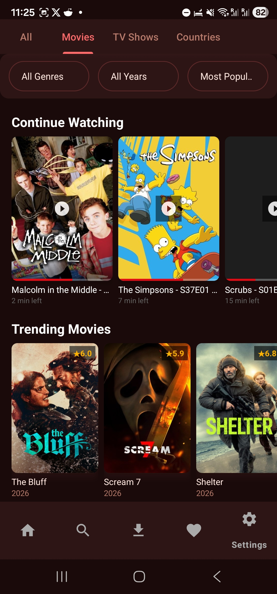
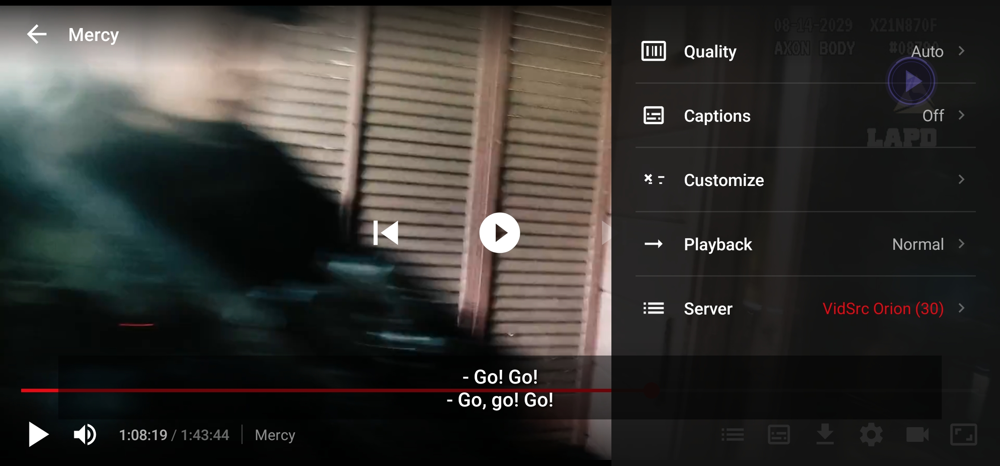
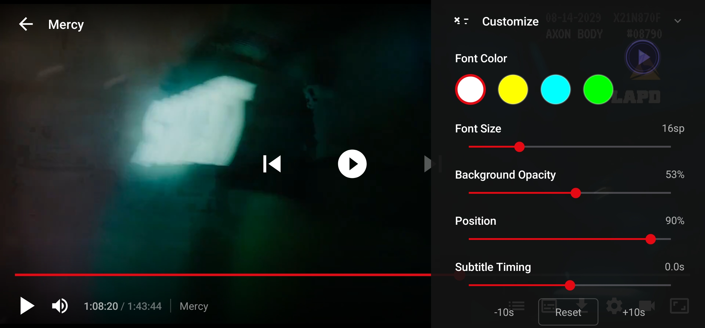
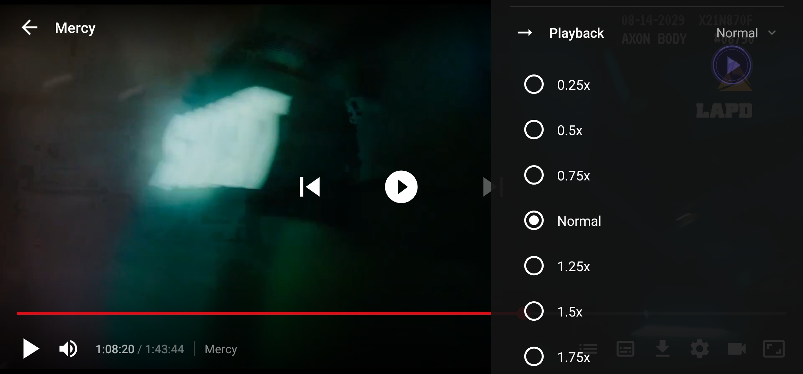
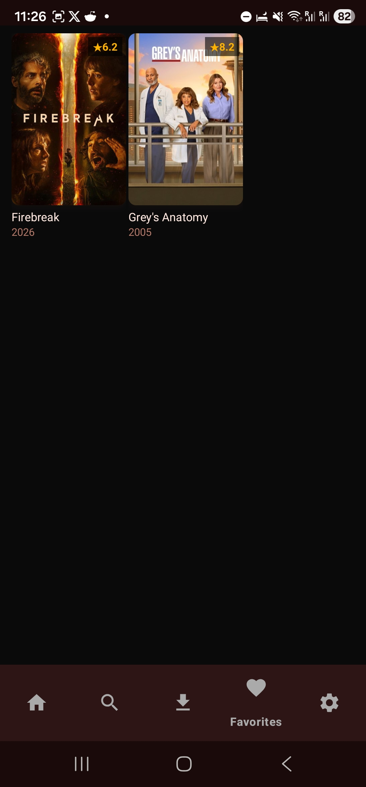
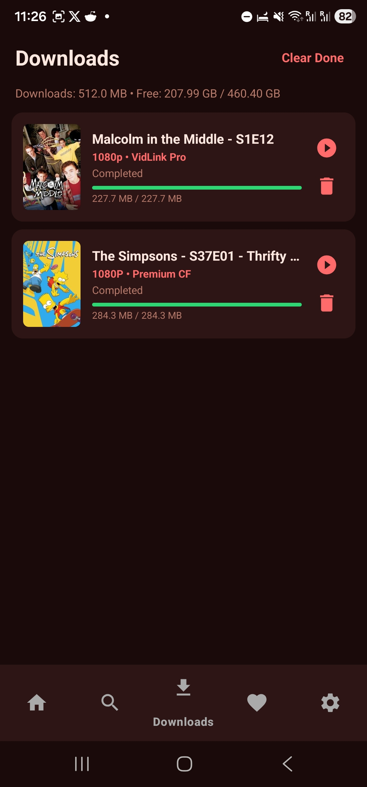
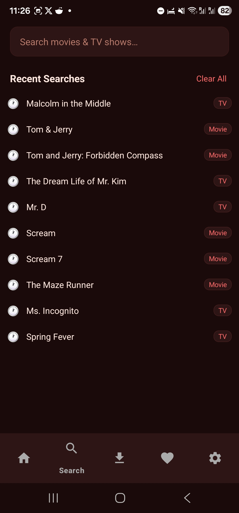
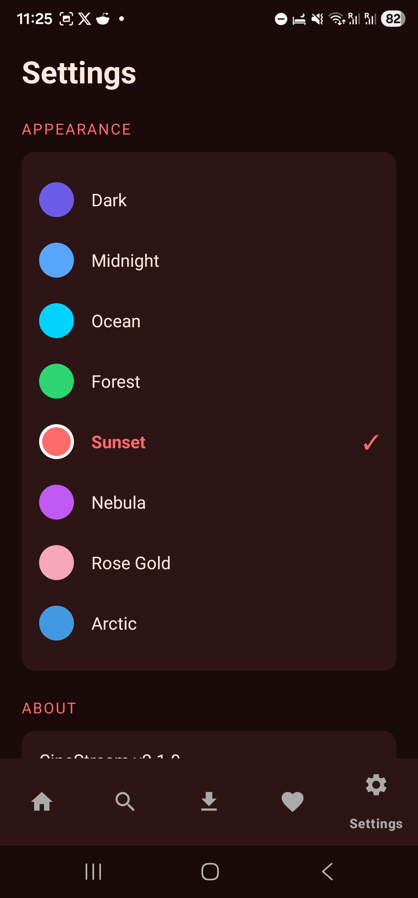
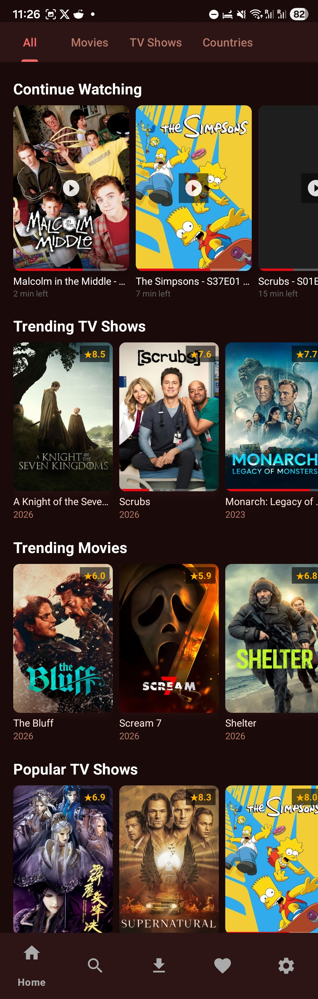

# 🎬 CineStream — Free Movie & TV Streaming App

### The #1 Ad-Free Alternative to HDO Box, Cinema HD, BeeTV & More

---

**Stream unlimited movies, TV shows & series — completely FREE with ZERO ADS.**
No pop-ups. No banners. No interruptions. Just pure entertainment.

[📱 Download Now](https://github.com/D13056/CineStream/releases/latest) · [🌐 Visit Website](https://D13056.github.io/CineStream/) · [💬 Join Community](https://t.me/CineStreamCommunity) · [📢 Updates Channel](https://t.me/CineStreamUpdates)

---

## 🚀 Why CineStream?

| Feature | CineStream | HDO Box | Cinema HD | BeeTV |
|---------|:----------:|:-------:|:---------:|:-----:|
| **Zero Ads** | ✅ | ❌ | ❌ | ❌ |
| **No Pop-ups** | ✅ | ❌ | ❌ | ❌ |
| **Free to Use** | ✅ | ✅ | ✅ | ✅ |
| **1080p / 4K Streaming** | ✅ | ✅ | ⚠️ | ⚠️ |
| **Subtitles (Multi-language)** | ✅ | ⚠️ | ⚠️ | ⚠️ |
| **Download for Offline** | ✅ | ⚠️ | ❌ | ❌ |
| **Netflix-like UI** | ✅ | ❌ | ❌ | ❌ |
| **Regular Updates** | ✅ | ❌ | ❌ | ❌ |
| **Picture-in-Picture** | ✅ | ❌ | ❌ | ❌ |
| **Continue Watching** | ✅ | ❌ | ❌ | ❌ |
| **Multi-Source Player** | ✅ | ✅ | ⚠️ | ⚠️ |

---

## ✨ Features

### 🎥 Unlimited Streaming
- **100,000+ Movies & TV Shows** — from Hollywood blockbusters to Bollywood hits, Korean dramas, anime, and more
- **1080p & 4K Quality** — crystal-clear streaming with adaptive bitrate
- **Multiple Sources** — if one source fails, it automatically switches to the next
- **Real-Time Updates** — new releases added daily

### 🚫 Absolutely ZERO ADS
- **No pre-roll ads** before videos
- **No banner ads** cluttering the screen
- **No pop-up ads** interrupting your experience
- **No redirect ads** sending you to spam sites
- **No ad trackers** collecting your data
- 100% clean, ad-free entertainment

### 🎨 Netflix-Style Experience
- **Beautiful dark UI** with smooth animations
- **Continue Watching** — pick up right where you left off
- **Watchlist & Favorites** — save content to watch later
- **Smart Search** — find anything instantly with live suggestions
- **Trending & Popular** — discover what's hot right now
- **Genre Browser** — action, comedy, horror, sci-fi, romance, thriller & more

### 📥 Download & Offline Viewing
- Download movies and episodes for offline viewing
- Multiple quality options (360p to 1080p)
- **VidSrc Direct Downloads** — fast, reliable download links
- **Multiple download servers** — GoFile, FastCloud, and more

### 🎬 Advanced Player
- **Built-in HLS Player** with Netflix skin
- **Picture-in-Picture (PiP)** mode — watch while multitasking
- **Subtitle Support** — English, Spanish, French, Hindi, Arabic, and 50+ languages
- **Gesture Controls** — swipe to adjust brightness & volume
- **Resume Playback** — always picks up where you stopped
- **Cast to TV** — Chromecast support

### 📱 Device Features
- **Android 7.0+ Support** (API 24+)
- **Lightweight** — only 8 MB APK size
- **Low Battery Usage** — optimized for all-day streaming
- **Works on Phones, Tablets & Android TV**

---

## 📲 Installation Guide

### Step 1: Download
Download the latest APK from [**Releases**](https://github.com/D13056/CineStream/releases/latest)

### Step 2: Enable Unknown Sources
Go to **Settings → Security → Install Unknown Apps** → Enable for your browser

### Step 3: Install & Enjoy
Open the APK file and tap **Install**. Launch CineStream and start streaming!

> **Note:** CineStream is not available on Google Play Store. This is the official distribution channel.

---

## 📸 Screenshots

<table>
<tr>
<td></td>
<td></td>
<td></td>
</tr>
<tr>
<td align="center"><b>▶️ Video Player</b></td>
<td align="center"><b>🔤 Subtitle Settings</b></td>
<td align="center"><b>⚡ Playback Speed</b></td>
</tr>
<tr>
<td></td>
<td></td>
<td></td>
</tr>
<tr>
<td align="center"><b>🏠 Home Screen</b></td>
<td align="center"><b>❤️ Favorites</b></td>
<td align="center"><b>📥 Downloads</b></td>
</tr>
<tr>
<td></td>
<td></td>
<td></td>
</tr>
<tr>
<td align="center"><b>🔍 Search</b></td>
<td align="center"><b>⚙️ Settings</b></td>
<td align="center"><b>📱 Home (Full View)</b></td>
</tr>
</table>

---

## 🌍 Available Content

### Movies
Action, Adventure, Animation, Comedy, Crime, Documentary, Drama, Family, Fantasy, History, Horror, Music, Mystery, Romance, Science Fiction, Thriller, War, Western

### TV Shows & Series
Korean Dramas (K-Drama), Anime, Turkish Series, Spanish Series, Hindi Web Series, British TV, Reality TV, Talk Shows, Mini Series, Documentaries

### Languages
English, Hindi, Spanish, French, German, Italian, Portuguese, Japanese, Korean, Chinese, Arabic, Turkish, Thai, Indonesian, Vietnamese, Filipino, and 50+ more

### Supported Countries
🇺🇸 USA · 🇬🇧 UK · 🇨🇦 Canada · 🇦🇺 Australia · 🇮🇳 India · 🇩🇪 Germany · 🇫🇷 France · 🇪🇸 Spain · 🇮🇹 Italy · 🇧🇷 Brazil · 🇲🇽 Mexico · 🇯🇵 Japan · 🇰🇷 South Korea · 🇹🇷 Turkey · 🇵🇭 Philippines · 🇮🇩 Indonesia · 🇻🇳 Vietnam · 🇹🇭 Thailand · 🇸🇦 Saudi Arabia · 🇦🇪 UAE · 🇪🇬 Egypt · 🇿🇦 South Africa · 🇳🇬 Nigeria · 🇰🇪 Kenya · 🇵🇰 Pakistan · 🇧🇩 Bangladesh · 🇱🇰 Sri Lanka · 🇳🇵 Nepal · 🇲🇾 Malaysia · 🇸🇬 Singapore · 🇳🇿 New Zealand · 🇳🇱 Netherlands · 🇧🇪 Belgium · 🇸🇪 Sweden · 🇳🇴 Norway · 🇩🇰 Denmark · 🇫🇮 Finland · 🇵🇱 Poland · 🇷🇴 Romania · 🇬🇷 Greece · 🇨🇿 Czech Republic · 🇭🇺 Hungary · 🇦🇹 Austria · 🇨🇭 Switzerland · 🇮🇪 Ireland · 🇵🇹 Portugal · 🇦🇷 Argentina · 🇨🇱 Chile · 🇨🇴 Colombia · 🇵🇪 Peru · 🇻🇪 Venezuela

---

## 🔄 Changelog

### v2.0 (Latest) — March 2026
- ✅ Netflix-style UI with dark theme
- ✅ Multi-source stream extraction (8 sources)
- ✅ VidSrc direct download integration
- ✅ Picture-in-Picture mode
- ✅ Advanced subtitle support (50+ languages)
- ✅ Continue Watching feature
- ✅ Download tab with search
- ✅ Premium system with 3-day free trial
- ✅ Device management (up to 3 devices)
- ✅ Performance optimizations

### v1.0 — February 2026
- 🎉 Initial release
- Basic streaming with TMDB integration
- Search and browse functionality

---

## 📢 Community & Support

- **Telegram Channel:** [@CineStreamUpdates](https://t.me/CineStreamUpdates) — Get instant update notifications
- **Telegram Group:** [@CineStreamCommunity](https://t.me/CineStreamCommunity) — Chat with other users, request features
- **GitHub Issues:** [Report bugs or request features](https://github.com/D13056/CineStream/issues)

---

## ❓ FAQ

<b>Is CineStream free?</b>

Yes, CineStream is completely free to download and use. There's an optional premium subscription for additional features.

<b>Does CineStream have ads?</b>

No! CineStream is 100% ad-free. No pop-ups, no banners, no video ads. Ever.

<b>Is it safe to install?</b>

Yes. CineStream doesn't collect personal data. The APK is signed and verified. You can scan it with any antivirus.

<b>Why isn't it on the Play Store?</b>

Due to content licensing policies, CineStream is distributed through GitHub releases. This is the official channel.

<b>What Android version do I need?</b>

Android 7.0 (Nougat) or higher. Works on phones, tablets, and Android TV boxes.

<b>Can I cast to my TV?</b>

Yes! CineStream supports Chromecast and screen mirroring.

<b>Buffering issues?</b>

Try switching to a different source in the player. CineStream offers multiple sources — if one is slow, another might be faster for your region.

---

## 🏷️ Tags & Keywords

`free movies app` `free tv shows app` `stream movies free` `watch movies online free` `no ads movie app` `ad-free streaming` `hdo box alternative` `cinema hd alternative` `beetv alternative` `movie box alternative` `showbox alternative` `tea tv alternative` `filmplus alternative` `stremio alternative` `kodi alternative` `popcorn time alternative` `leonflix alternative` `typhoon tv alternative` `cyberflix alternative` `morph tv alternative` `free movie streaming 2026` `watch movies without ads` `download movies free` `offline movies app` `android movie app` `1080p movie app` `4k streaming app` `netflix free alternative` `bollywood movies app` `hollywood movies free` `korean drama app` `anime streaming app` `turkish series app` `subtitle movie app` `picture in picture movie` `chromecast movie app` `android tv movie app` `best free movie app 2026`

---

### ⭐ If you enjoy CineStream, give us a star!

**Made with ❤️ for movie & TV lovers worldwide**

